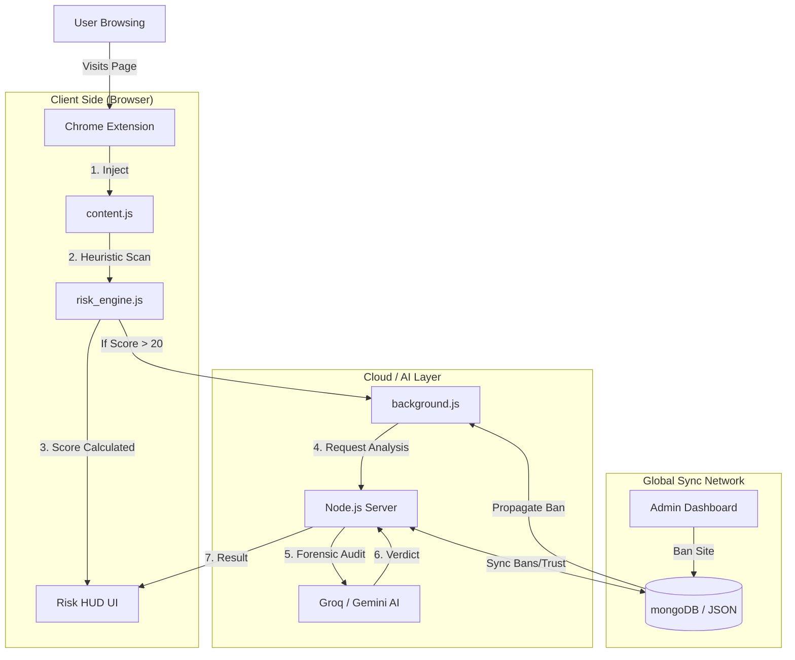

# 🛡️ PhishingShield 2.0: The Ultimate AI-Powered Browser Security Suite

   

**PhishingShield** is a comprehensive, client-side browser security suite designed to protect users from modern web threats in real-time. Unlike traditional antivirus software that relies solely on static blacklists, PhishingShield employs a multi-layered heuristic risk engine, **Real-Time Global Synchronization**, and cutting-edge **Generative AI** to detect Zero-Day phishing attacks, brand impersonation, and malicious browser extensions.

---

## 🏗️ Architecture Visualization



## ⚔️ Why PhishingShield?

| Feature | 🚫 Traditional Antivirus | 🛡️ PhishingShield 2.0 |
| :--- | :--- | :--- |
| **Detection Method** | Static Blacklists (Slow) | **Real-Time AI & Heuristics** (Instant) |
| **New Threats** | Fails on Zero-Day attacks | **Detects Unknown Threats** via Logic |
| **User Feedback** | Passive / Non-existent | **Community Trust Scores** & Voting |
| **Education** | Blocks page without explanation | **Explains WHY** (e.g., "Typosquatting") |
| **Protection Speed** | Hours/Days to update DB | **< 10 Seconds** (Global Sync) |
| **AI Integration** | None / Cloud-heavy | **Hybrid** (Local + Groq/Gemini LLM) |

---

## 🚀 Key Features

### 1. 🔍 Intelligent Risk Engine (`risk_engine.js`)
The core of our defense is a purely client-side heuristic engine that analyzes every webpage in milliseconds.
*   **Brand Impersonation Detection**: Compares page content/titles against a protected list of major brands (PayPal, Google, SBI, etc.).
*   **Typosquatting Sentinel**: Detects deceptive domains like `goog1e.com` or `paypaI.com` using complex Levenshtein distance algorithms.
*   **Punycode & Homograph Detecion**: Blocks international character spoofing (e.g., Cyrillic 'a' vs Latin 'a').
*   **Domain Entropy Analysis**: Identifies randomly generated domains often used by botnets.
*   **Quishing (QR Phishing) Detector**: Scans images for QR codes and decodes them to verify if they lead to safe or malicious URLs.
*   **Extension Security Audit**: Scans *other* installed extensions to detect rogue scripts injecting code into your pages.

### 2. 🤖 Dual-Engine AI Analysis
When heuristics flag a site as suspicious (Score 20-50), the **AI Cloud Layer** is engaged for a forensic audit.
*   **Groq (Llama-3)**: Acts as the primary "Forensic Analyst", scanning page tone, hidden threats, and social engineering patterns in <1s.
*   **Google Gemini**: Serves as the "Failover Validator", ensuring 99.9% uptime and double-checking high-risk verdicts.
*   **The Result**: If confirmed, the HUD turns **Red** and displays a detailed report (e.g., "AI Detected: Imitating Amazon Login page with urgency tactics").

#### 🧠 AI Decision Logic
```mermaid
graph LR
    A[Suspicious Page] --> B{Heuristic Score > 20?}
    B -- No --> C[Green HUD]
    B -- Yes --> D[Snapshot DOM]
    D --> E[Send to Groq Llama-3]
    E --> F{Is Phishing?}
    F -- No --> G[Mark Safe (Cache)]
    F -- Yes --> H{Confidence > 80%?}
    H -- Yes --> I[🔴 BLOCK & ALERT]
    H -- No --> J[Consult Gemini (Fallback)]
    J --> I
```

### 3. 🛡️ The Risk HUD (Head-Up Display)
A non-intrusive, futuristic overlay that keeps you informed without blocking your view.

#### 📊 Threat Matrix
| Risk Level | Score Range | Color | Meaning | Action User Should Take |
| :--- | :---: | :---: | :--- | :--- |
| **SAFE** | **0 - 20** | 🟢 Green | Verified Brand or Clean Domain | Safe to Browse. |
| **CAUTION** | **21 - 50** | 🟡 Yellow | Suspicious traits (New Domain, HTTP) | **Proceed with care.** Don't enter passwords. |
| **DANGEROUS** | **51 - 79** | 🟠 Orange | High Heuristic Risk (Typosquatting) | **Leave Immediately.** Extremely risky. |
| **CRITICAL** | **80 - 100** | 🔴 Red | **AI Confirmed Phishing** / Malware | **BLOCKED.** Do not interact. Report it. |

*   **Interactive Info Panel**: Click the **ℹ️ Info Button** to see exactly *why* a page is flagged (e.g., "+30 Unencrypted Login", "+50 Typosquatting").

### 4. 🌐 Real-Time Global Synchronization
Protection follows you everywhere.
*   **Community Trust Network**: Every site has a dynamic trust score based on user upvotes/downvotes.
*   **Global Ban Propagation**: When an Admin bans a malicious site, the update is pushed to **all connected users** within 10 seconds.
*   **Hybrid Sync**: Merges data from your Local Server (DEV) and Global Cloud, ensuring you never miss a threat.

### 5. 🎮 Gamification & XP System
Security doesn't have to be boring.
*   **Earn XP**: Gain points for reporting threats, visiting safe sites, and keeping streaks.
*   **Ranks**: Progress from **Novice** 🥉 to **Scout** 🥈 to **Sentinel** 🥇.
*   **Unlock Features**: High-level features (like ML Analysis and Chameleon Anti-Bot) are unlocked as you level up.

### 7. 🛡️ Advanced Download Protection
PhishingShield analyzes incoming downloads for hidden threats:
*   **Double Extension Detection**: Blocks files like `invoice.pdf.exe` used to trick users.
*   **Source Correlation**: If you download a file from a site flagged as "High Risk" (Score > 60), the download is flagged even if the file type looks safe.
*   **Fortress Mode**: A special lockdown mode that blocks *all* 3rd party scripts on a page (useful for analyzing dangerous sites safely).

### 8. 🚨 Report, Ban, & Unban Lifecycle
*   **Report**: Right-click any page -> "Report to PhishingShield".
*   **Ban**: Admins review reports in the Dashboard and ban sites with one click.
*   **Enforcement**: Banned sites are blocked instantly using Chrome's `declarativeNetRequest` API.

---

## 🛠️ Installation & Setup

### Prerequisites
*   **Node.js** (v16+)
*   **Google Chrome**, Edge, or Brave Browser.

### Step 1: Backend Server Setup
The backend handles AI requests, database sync, and user accounts.
```bash
# Clone the repository
git clone https://github.com/subratkumarpadhy4/PhishingShield.git
cd PhishingShield/server

# Install dependencies
npm install

# Configure Environment Variables
# Create a .env file with your API keys:
echo "GROQ_API_KEY=your_groq_key" >> .env
echo "GEMINI_API_KEY=your_gemini_key" >> .env

# Start the Server
npm start
```
*   *Note: Runs on `http://localhost:3000` by default.*

### Step 2: Extension Installation
1.  Open Chrome and navigate to `chrome://extensions`.
2.  Toggle **Developer Mode** (top-right corner).
3.  Click **Load Unpacked**.
4.  Select the **root folder** of this project (`/PhishingShield-2.0`).
5.  Pin the **Shield Icon 🛡️** to your browser toolbar.

---

## 🧪 How to Test (Demo Scenarios)

### Scenario A: The AI Phishing Test
1.  Navigate to `tests/ai_phishing_test.html`.
2.  This page contains "Urgency Keywords" (e.g., "Account Suspended").
3.  **Observation**:
    *   Initially, the HUD shows **Yellow (~30)**.
    *   After 2 seconds, the AI analysis completes.
    *   HUD turns **Red (95+)**.
    *   Open Info Panel to see: "🤖 AI Analysis Detected Threat".

### Scenario B: Typosquatting
1.  Navigate to a legitimate site (e.g., `google.com`). HUD is **Green**.
2.  Open `tests/fake_instagram.html` (simulates a fake login).
3.  **Observation**:
    *   HUD detects **"Unencrypted Password Field" (+50)**.
    *   HUD detects **"Brand Impersonation" (+30)**.
    *   Score hits **Critical**.

### Scenario C: QR Quishing
1.  Open `tests/qr_safe.html`.
2.  The engine scans the QR code.
3.  **Observation**:
    *   If the QR leads to a known safe domain (e.g., Google), the HUD remains **Green**.
    *   If the QR leads to a suspicious URL, the score increases.

---

## 📂 Project Structure

*   **/js**:
    *   `content.js`: The HUD UI and main orchestration logic.
    *   `risk_engine.js`: Heuristic algorithms (Entropy, Typosquatting, etc.).
    *   `background.js`: Handles API calls, Global Sync, and Declarative Blocking.
*   **/server**: Node.js Express backend for AI and Database.
*   **/tests**: HTML files for testing various attack vectors safely.
*   **/css**: Styles for the futuristic HUD interface.

---

## 🔒 Permissions Explained

| Permission | Reason |
| :--- | :--- |
| **`declarativeNetRequest`** | To block banned sites instantly at the network level. |
| **`scripting`** | To inject the Risk Engine and HUD into webpages. |
| **`storage`** | To save XP, user settings, and cached AI results. |
| **`activeTab`** | To capture page text for AI analysis. |
| **`contextMenus`** | Adds the "Report Phishing" right-click menu. |

---

## 📄 License
MIT License. Open Source for Educational and Security Research.

**Built with ❤️ by the PhishingShield Team**
